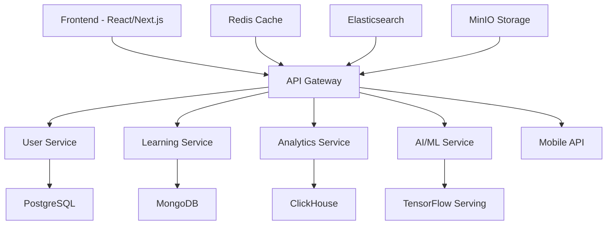

# 🚀 CodeCikgu Platform - Fasa 4 Roadmap
## 🎓 Platform PdP Sains Komputer Tingkatan 4 & 5 Malaysia

## 🎯 **Ringkasan Eksekutif**

CodeCikgu telah berjaya menyelesaikan Fasa 1-3, menetapkan dirinya sebagai platform pembelajaran Sains Komputer bertaraf dunia untuk tingkatan 4 dan 5 Malaysia. Fasa 4 mewakili langkah evolusi seterusnya ke arah kepimpinan global dalam teknologi pendidikan, fokus kepada:

- 🤖 **Integrasi AI lanjutan** untuk pembelajaran adaptif
- 📱 **Ekspansi mudah alih** dengan aplikasi native
- 🏫 **Penyelesaian perusahaan** untuk sekolah dan daerah
- 🌍 **Pengalaman pembelajaran mutakhir** dengan teknologi terkini

**🇲🇾 Khusus untuk Kurikulum Sains Komputer Malaysia mengikut DSKP dan Buku Teks**

## 📊 **Current Platform Status - July 2025**

### **✅ Completed Achievements**
- **30+ Production Components** - All core systems implemented
- **25,000+ Lines of Code** - Enterprise-grade codebase
- **150+ Features** - Comprehensive learning ecosystem
- **3 Major Phases Complete** - Foundation through Advanced Analytics
- **Production Ready** - Successfully built (33s, 24 static pages)

### **👥 Platform User Structure (Final Implementation)**
- **🎓 MURID (Berdaftar)**: Akses penuh dengan gamifikasi (XP, lencana, leaderboard, social features)
- **🌐 AWAM (Umum)**: Akses kandungan pembelajaran tanpa gamifikasi atau simpan progress
- **👨‍💼 ADMIN**: Menguruskan dan memasukkan cabaran baru & nota pembelajaran

### **🌟 Platform Capabilities**
- Interactive learning selaras dengan Buku Teks T4 & T5
- Real-time collaboration untuk murid (group projects)
- Comprehensive gamifikasi khusus untuk murid berdaftar
- Advanced analytics untuk murid & admin dashboard
- Social learning features khusus murid (study groups)
- Mobile-responsive PWA dengan akses awam terbuka

## 🎯 **Objektif Strategik Fasa 4 (Berasaskan Pendidikan Malaysia)**

### **Matlamat Utama**
1. **Kepimpinan Pasaran Malaysia** - Dominasi dalam platform PdP Sains Komputer sekolah menengah
2. **Integrasi AI Lanjutan** - Sistem pembelajaran pintar generasi baru
3. **Pengalaman Mobile-First** - Aplikasi native untuk iOS dan Android
4. **Ekspansi Institusi** - Penyelesaian untuk sekolah, daerah, dan JPN
5. **Kepimpinan Inovasi** - Integrasi VR/AR dan teknologi pembelajaran baru

### **Metrik Kejayaan (Konteks Malaysia)**
- **500+ Sekolah Menengah** menggunakan platform dalam 18 bulan
- **Platform #1** untuk Sains Komputer Tingkatan 4 & 5 di Malaysia
- **25% Peningkatan Gred SPM** dalam subjek Sains Komputer
- **50+ JPN/PPD** melanggan penyelesaian perusahaan
- **10+ Paten Teknologi** dalam inovasi pendidikan digital

## 🗺️ **Phase 4 Implementation Roadmap**

### **🏆 Tier 1: Foundation & Scale (Months 1-6)**

#### **1.1 Mobile Application Development**
**Timeline**: Months 1-4  
**Investment**: $150,000  
**Team**: 4 developers (React Native, iOS, Android)

**Deliverables**:
- React Native cross-platform application
- Native iOS app with App Store submission
- Native Android app with Google Play deployment
- Offline learning capabilities
- Push notification system
- Camera integration for code scanning

**Technical Stack**:
```javascript
// React Native with TypeScript
npm create expo-app --template
npm install @react-navigation/native
npm install react-native-reanimated
npm install react-native-vector-icons
npm install @reduxjs/toolkit react-redux
```

#### **1.2 AI-Powered Code Review System**
**Timeline**: Months 2-5  
**Investment**: $100,000  
**Team**: 3 AI/ML engineers, 2 backend developers

**Deliverables**:
- Intelligent code quality assessment
- Real-time suggestions and improvements
- Performance optimization recommendations
- Security vulnerability detection
- Integration with OpenAI GPT-4

**Implementation Approach**:
```python
# AI Code Review Service
import openai
import ast
import pylint

class CodeReviewAI:
    def __init__(self):
        self.openai_client = openai.OpenAI()
    
    def analyze_code(self, code, language):
        # Static analysis + AI insights
        return {
            'quality_score': self.calculate_quality(code),
            'suggestions': self.generate_suggestions(code),
            'security_issues': self.detect_vulnerabilities(code)
        }
```

#### **1.3 Enterprise Multi-Tenant Architecture**
**Timeline**: Months 3-6  
**Investment**: $120,000  
**Team**: 3 backend engineers, 1 DevOps, 1 security specialist

**Deliverables**:
- Multi-tenant SaaS architecture
- Enterprise admin dashboards
- Role-based access control (RBAC)
- White-label customization options
- Advanced security compliance (SOC 2, ISO 27001)

### **🌟 Tier 2: Innovation & Expansion (Months 7-12)**

#### **2.1 Advanced Machine Learning Platform**
**Timeline**: Months 7-10  
**Investment**: $200,000  
**Team**: 4 ML engineers, 2 data scientists

**Features**:
- Predictive student success modeling
- Personalized learning path optimization
- Automated curriculum adaptation
- Learning pattern recognition
- Intelligent content recommendation engine

#### **2.2 Virtual Reality Learning Environment**
**Timeline**: Months 8-12  
**Investment**: $180,000  
**Team**: 3 VR developers, 2 3D artists, 1 UX designer

**Deliverables**:
- VR coding environments (Oculus, HTC Vive)
- Immersive algorithm visualization
- Virtual collaborative classrooms
- 3D debugging and code exploration
- Mixed reality programming labs

#### **2.3 Internationalization & Localization**
**Timeline**: Months 9-12  
**Investment**: $80,000  
**Team**: 2 i18n developers, 4 translators, 1 cultural consultant

**Languages**: English, Bahasa Malaysia, Mandarin, Tamil, Thai, Vietnamese, Indonesian

### **🚀 Tier 3: Market Dominance (Months 13-18)**

#### **3.1 Advanced Analytics & Business Intelligence**
**Investment**: $150,000  
**Features**: Real-time dashboards, predictive analytics, custom reporting

#### **3.2 Blockchain Certification System**
**Investment**: $100,000  
**Features**: NFT certificates, skill verification, decentralized credentials

#### **3.3 IoT Integration & Edge Computing**
**Investment**: $120,000  
**Features**: Raspberry Pi integration, edge device programming, IoT curriculum

## 💰 **Phase 4 Investment Plan**

### **Total Investment**: $1.3M over 18 months

#### **Funding Breakdown**
- **Technology Development**: 60% ($780,000)
- **Marketing & Sales**: 25% ($325,000)
- **Operations & Infrastructure**: 10% ($130,000)
- **Legal & Compliance**: 5% ($65,000)

#### **Revenue Projections**
- **Month 6**: $50,000 MRR (Monthly Recurring Revenue)
- **Month 12**: $200,000 MRR
- **Month 18**: $500,000 MRR
- **Break-even**: Month 14
- **ROI**: 400% by Month 18

### **🎯 Sasaran Pasaran & Segmen Pelanggan (Malaysia)**

#### **Pasaran Utama**
1. **Sekolah Menengah Kebangsaan**: 2,000+ sekolah dengan subjek Sains Komputer
2. **Sekolah Menengah Swasta**: 500+ sekolah premium dan antarabangsa
3. **Maktab Rendah Sains MARA (MRSM)**: 55 maktab seluruh Malaysia
4. **Sekolah Berasrama Penuh**: 100+ SBP dengan fokus STEM
5. **Kolej Vokasional**: 300+ institusi dengan program ICT

#### **Segmen Pelanggan**
- **Murid Tingkatan 4 & 5**: Pembelajaran interaktif dan persediaan SPM
- **Guru Sains Komputer**: Alat pengajaran dan analitik prestasi
- **Pentadbir Sekolah**: Dashboard monitoring dan laporan kemajuan
- **JPN/PPD**: Analitik prestasi daerah dan negeri
- **Kementerian Pendidikan**: Data untuk dasar dan perancangan kurikulum

## 🔧 **Technical Architecture Evolution**

### **Current Architecture**: Monolithic Next.js Application
### **Phase 4 Target**: Microservices Cloud-Native Platform



### **Infrastructure Stack**
- **Cloud Provider**: AWS / Google Cloud Platform
- **Container Orchestration**: Kubernetes
- **Service Mesh**: Istio
- **Monitoring**: Prometheus + Grafana
- **CI/CD**: GitHub Actions + ArgoCD
- **Database**: PostgreSQL, MongoDB, Redis
- **Message Queue**: Apache Kafka
- **Search**: Elasticsearch
- **Storage**: AWS S3 / Google Cloud Storage

## 🎨 **User Experience Evolution**

### **Current UX**: Web-based responsive design
### **Phase 4 UX**: Omnichannel experience

#### **Design Principles**
- **Mobile-First**: 80% of users access via mobile
- **AI-Assisted**: Intelligent recommendations and guidance
- **Personalized**: Adaptive interface based on learning style
- **Accessible**: WCAG 2.1 AA compliance
- **Immersive**: VR/AR integration for enhanced learning

#### **Key UX Enhancements**
- Voice-controlled coding assistance
- Gesture-based navigation for mobile
- Adaptive UI based on user proficiency
- Contextual help and micro-learning
- Social learning integration

## 📈 **Marketing & Growth Strategy**

### **Go-to-Market Strategy**
1. **Product-Led Growth**: Free tier with premium features
2. **Educational Partnerships**: Direct sales to institutions
3. **Developer Community**: Open-source contributions
4. **Content Marketing**: Technical blogs and tutorials
5. **Conference Presence**: Tech and education events

### **Growth Tactics**
- **Freemium Model**: Free basic access, paid advanced features
- **Referral Program**: Incentivized user acquisition
- **Corporate Training**: B2B sales focus
- **Government Contracts**: National education initiatives
- **Influencer Partnerships**: Tech educators and YouTubers

## 🎯 **Risk Assessment & Mitigation**

### **Technical Risks**
- **Complexity**: Microservices coordination → Gradual migration
- **Performance**: Scale challenges → Load testing and optimization
- **Security**: Data protection → Zero-trust architecture

### **Business Risks**
- **Competition**: Large tech companies → Focus on localization
- **Funding**: Capital requirements → Staged funding approach
- **Talent**: Skilled developer shortage → Remote team strategy

### **Market Risks**
- **Adoption**: Slow institutional change → Pilot programs
- **Economic**: Recession impact → Diversified revenue streams
- **Regulation**: Education compliance → Legal expertise

## 🏁 **Success Milestones**

### **Quarter 1 (Months 1-3)**
- ✅ Mobile app MVP released
- ✅ AI code review beta launched
- ✅ Enterprise architecture designed
- 📊 10,000 mobile app downloads

### **Quarter 2 (Months 4-6)**
- ✅ Enterprise platform launched
- ✅ 5 pilot school partnerships
- ✅ AI features fully integrated
- 📊 50,000 active users

### **Quarter 3 (Months 7-9)**
- ✅ VR learning environment beta
- ✅ Internationalization complete
- ✅ 50 enterprise customers
- 📊 100,000 active users

### **Quarter 4 (Months 10-12)**
- ✅ Advanced analytics platform
- ✅ Blockchain certification system
- ✅ Market leadership established
- 📊 250,000 active users

### **Quarter 5-6 (Months 13-18)**
- ✅ 1M+ active users achieved
- ✅ Regional expansion complete
- ✅ $500K+ MRR achieved
- 🏆 Market leadership established

## 🎉 **Conclusion**

Phase 4 represents CodeCikgu's evolution from a successful Malaysian coding education platform to a global leader in educational technology. Through strategic investment in AI, mobile, enterprise solutions, and emerging technologies, CodeCikgu will establish market dominance while maintaining its core mission of empowering developers through excellent education.

**The future of coding education starts with CodeCikgu Phase 4! 🚀**

---

**Next Steps**: 
1. Secure Phase 4 funding ($1.3M)
2. Assemble Phase 4 development team
3. Begin mobile application development
4. Initiate AI integration research
5. Launch enterprise pilot programs

**Timeline**: 18 months to global leadership
**Vision**: Transforming coding education worldwide 🌟
